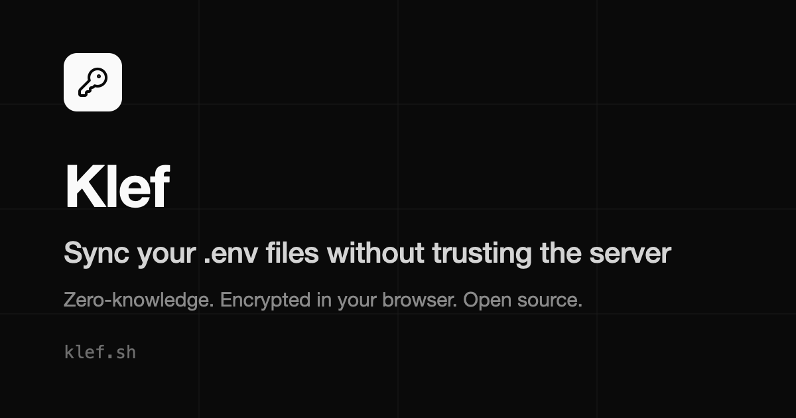

# Klef

**Personal, zero-knowledge `.env` sync.** Paste your env files in, sync them
across machines, pull them back down — all end-to-end encrypted. The server
only ever stores ciphertext; your keys never leave the browser.

**Live at [klef.sh](https://klef.sh)** — free, open source
([AGPL-3.0](./LICENSE)), and built to be
[self-hosted](#self-hosting) on your own Cloudflare account.



## What it does

- **Paste → diff → save.** Paste an updated env file, review a line-level diff
  against the stored version (computed client-side, on decrypted text the
  server never sees), confirm, done.
- **End-to-end encrypted.** AES-256-GCM in the browser, before upload. The
  server, and the operator, can't read your values — ever.
- **Version history + restore.** Every save is a new immutable version.
- **Sign in ≠ unlock.** Google OAuth or passkeys prove who you are; a separate
  master passphrase (never sent anywhere) decrypts your data. Lock the vault —
  manually, by shortcut, or on an inactivity timer — without signing out.
- **Recovery key.** A one-time `KLEF-XXXXX-…` code is your only fallback if
  you forget the passphrase. Lose both and the data is unrecoverable by
  design.
- **Organize by workspace → project → file**, with environment labels
  (development/staging/production) and per-framework file-name suggestions.

## Who it's for

Klef is deliberately **not** an Infisical/Doppler/Vault competitor. No CLI, no
daemon, no file watcher, no team RBAC — just a dead-simple, truly
zero-knowledge vault for the `.env` files you'd otherwise sync through
AirDrop, Slack DMs, or a gist. If you need machine-to-machine secrets
injection, use one of those tools; if you're one developer with several
machines and a pile of env files, Klef is the honest, minimal answer.

## How it works (threat model in brief)

- **Zero-knowledge.** Env contents are encrypted in your browser with
  AES-256-GCM under a random per-account data-encryption key (DEK). The DEK is
  wrapped by a key derived from your master passphrase — Argon2id (19 MiB,
  t=2, per-account salt), with a PBKDF2-SHA-256 (600k) fallback where WASM is
  unavailable. The server sees only ciphertext, salts, and nonces.
- **Names plaintext, values encrypted.** Workspace/project/file names are
  stored in plaintext for navigation; only env *contents* are encrypted.
- **Auth ≠ unlock.** Logging in (Google/passkey) gets you a session; a
  separate master passphrase decrypts your data. A logged-in but locked
  client sees only ciphertext.
- **No server-side recovery.** Lose both your passphrase and your recovery
  key and the data is gone — by design. There is no reset Klef could perform,
  because Klef never has the keys.

The full cryptographic contract lives in
[`src/shared/BLOB_FORMAT.md`](./src/shared/BLOB_FORMAT.md), the parameters in
[`src/shared/constants.ts`](./src/shared/constants.ts), and a prose
walkthrough at [klef.sh/security](https://klef.sh/security).

**Klef does _not_ protect against** a compromised client device (keylogger,
malicious extension), a weak passphrase brute-forced offline, or loss of both
passphrase and recovery key.

## Stack

Vite + React SPA (owns all crypto/diffing) · Hono on Cloudflare Workers ·
Better Auth · Cloudflare D1 · Wrangler + `@cloudflare/vite-plugin`. One
package, one dev server running the SPA and the Worker against real `workerd`
with a real D1 binding. No analytics, no trackers, no third-party scripts.

## Develop

Requires Node 20+ and [pnpm](https://pnpm.io).

```bash
pnpm install
cp .dev.vars.example .dev.vars        # auth secrets for local dev
pnpm db:migrate:local                 # apply migrations to local D1
pnpm dev                              # http://localhost:5173
```

Other scripts:

```bash
pnpm test          # Vitest: crypto units (node) + Worker/D1 (workerd via Miniflare)
pnpm typecheck     # tsc --noEmit
pnpm build         # typecheck + production build + prerendered marketing pages
```

## Self-hosting

Klef is built to be forked and self-hosted on your own Cloudflare account —
the single-repo Cloudflare deploy makes this genuinely easy, and it's a
first-class use case.

```bash
# 1. Fork + clone, then install
pnpm install

# 2. Authenticate Wrangler with your Cloudflare account
pnpm exec wrangler login

# 3. Create your own D1 database, then put its id in wrangler.jsonc
pnpm exec wrangler d1 create klef-db   # copy the database_id into wrangler.jsonc

# 4. Apply the schema to your remote D1
pnpm db:migrate:remote

# 5. Set production secrets (never committed)
pnpm exec wrangler secret put BETTER_AUTH_SECRET   # openssl rand -base64 32
pnpm exec wrangler secret put BETTER_AUTH_URL      # https://your-domain
pnpm exec wrangler secret put GOOGLE_CLIENT_ID
pnpm exec wrangler secret put GOOGLE_CLIENT_SECRET

# 6. Ship it
pnpm deploy
```

Create the Google OAuth client at the [Google Cloud
Console](https://console.cloud.google.com/apis/credentials) with an authorized
redirect URI of `https://your-domain/api/auth/callback/google`.

Because everything is end-to-end encrypted, the operator (you) still can't
read any stored secret — the same zero-knowledge guarantee holds whether Klef
is hosted by its author or by you.

## FAQ

**Why not just use Doppler/Infisical?** They're great team products with
server-side secret access for machines and CI. Klef trades all of that away
for one property they can't offer in their hosted form: the server
*mathematically cannot* read your secrets.

**What happens if klef.sh disappears?** Export your files anytime, or
self-host — the code is AGPL and the deploy is one wrangler command.

**Can I trust the client code?** The same question applies to any E2EE web
app. Klef's mitigation is radical transparency: the entire codebase is open,
the crypto is isolated in small pure functions
([`src/shared/`](./src/shared)), and you can self-host to pin the code you
audited.

## Contributing

Contributions are welcome — please read [`CONTRIBUTING.md`](./CONTRIBUTING.md)
first. It covers the dev workflow, the rule that the zero-knowledge crypto
contract must stay intact, how contributions are licensed, and the DCO
sign-off (`git commit -s`) that CI enforces.

## Security

See [`SECURITY.md`](./SECURITY.md) for the threat model and how to report
vulnerabilities.

## License

[AGPL-3.0-or-later](./LICENSE). Open source from the first commit — for a
secrets tool, auditability is the whole trust story.
